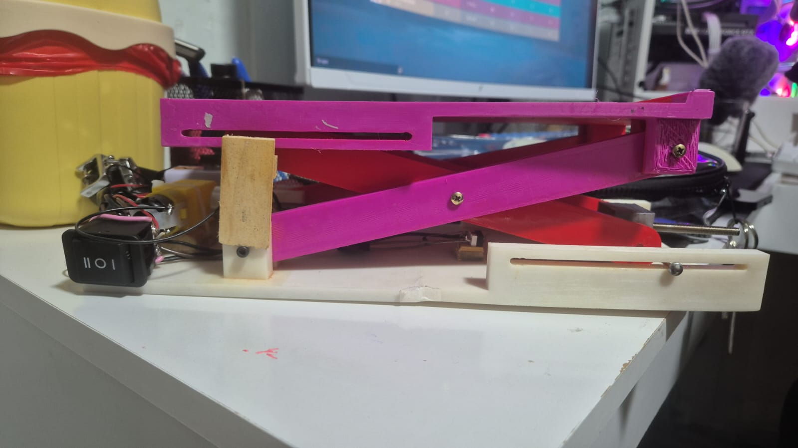
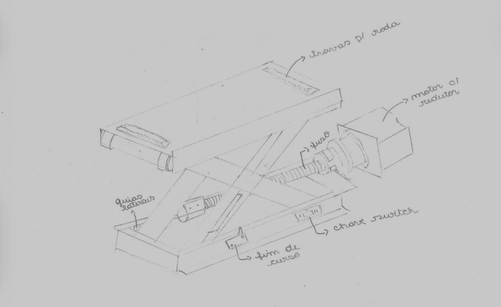
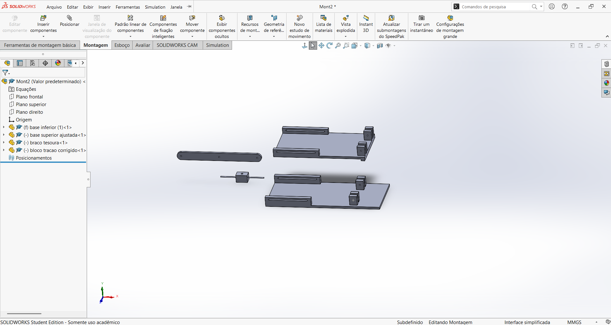
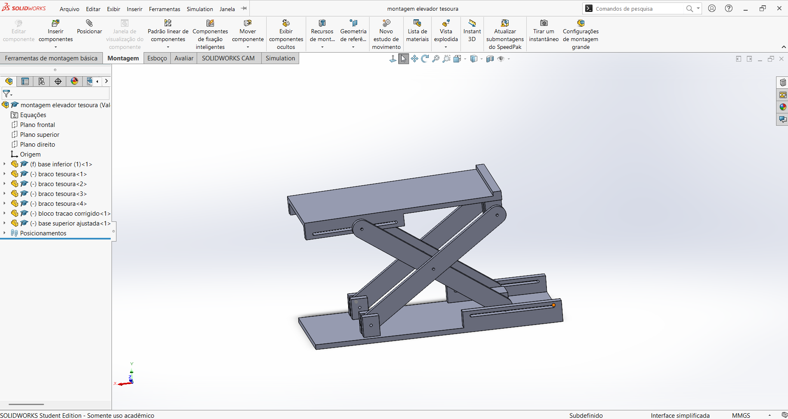
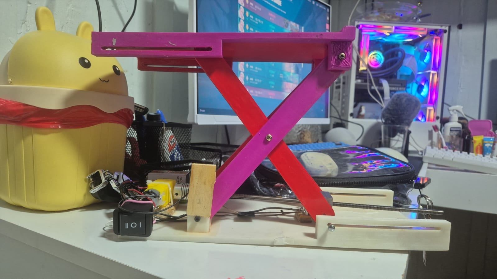

# ⚙️ Elevator Platform

A functional physical elevator platform prototype developed as an academic engineering project, combining conceptual design, 3D modeling, 3D printing and hands-on assembly.

## 📌 About the Project

This project was developed as part of a university engineering assignment in which the proposed solution was required to incorporate a small DC gear motor.

Rather than starting with a predefined product, the assignment challenged the team to identify a problem and develop a solution that incorporated the required motor.

Because of my interest in cars and hands-on automotive work, I proposed the idea of creating a small lifting platform that could represent a tool for working on vehicles at home.

From this initial idea, the project went through research and conceptual exploration before developing the final elevator platform prototype.

The development process included:

- Research and concept exploration
- Approximately 50 conceptual ideas
- Selection of a final concept
- Individual part modeling in SolidWorks
- 3D printing of the designed components
- Mechanical and electrical assembly
- Functional testing of the final prototype

## 💡 Concept Development

The ideation stage included approximately 50 concept explorations, with around half developed as hand-drawn sketches and the remaining ideas explored with AI-assisted tools.

I created all of the hand-drawn concepts and also contributed to part of the AI-assisted exploration process.

After evaluating the alternatives, a final concept was selected as the basis for the elevator platform.

## 🧩 3D Modeling

After selecting the final concept, the platform components were modeled in SolidWorks before physical construction.

I was responsible for modeling all of the individual parts used in the project. This stage involved translating the selected concept into components that could later be manufactured and assembled into the physical prototype.

### Final Assembly

After the individual components were modeled, the final SolidWorks assembly was created by another member of the team, Taynara, using the parts I had designed.

The assembly allowed the team to visualize how the individual components would fit together before moving forward with the physical prototype.

## 🛠️ Physical Construction

After the modeling stage, the designed components were 3D printed and used to build the physical prototype.

I was responsible for assembling the physical platform from the printed parts and integrating the mechanism into the final structure.

The platform uses a screw-driven mechanism to transform the rotational movement of the DC gear motor into vertical movement. As the motor rotates the screw, the traction mechanism allows the platform to move up and down.

## 🔧 Testing & Iteration

One of the main challenges appeared when the prototype moved from the digital model to physical testing.

The traction block I originally designed did not work as expected in the real mechanism. During assembly and testing, I had to adapt the solution using wire so the mechanism could achieve the movement required for the platform to operate correctly.

This was an important part of the development process because it showed that a component that works conceptually or in a digital model may still require adjustments when implemented in a physical system.

## 🎥 Functional Prototype

After the construction and testing stages, the platform was able to successfully move up and down using the motor-driven mechanism.

[▶️ Watch the elevator platform working](demo/elevator-platform-demo.mp4)

## 👩‍💻 My Contribution

This was a collaborative academic project. My main contributions included:

- Proposing the initial elevator platform concept, inspired by my interest in cars and home automotive work
- Creating all of the hand-drawn concept sketches
- Contributing to the AI-assisted concept exploration
- Modeling all individual components in SolidWorks
- Building and assembling the physical prototype
- Testing the mechanism and adapting the traction solution during construction

The final SolidWorks assembly was created by my teammate Taynara using the individual parts I had modeled. Project documentation was handled by other members of the team.

## 📚 What I Learned

This project was my first hands-on experience with SolidWorks, and I learned how to model individual parts while developing components for a real physical prototype.

I also learned how different a design can behave once it moves from a digital model to the physical world. Building and testing the platform required problem-solving, iteration and adapting the original design when parts of the mechanism did not work as expected.

Most importantly, the project gave me experience turning an initial idea into a functional prototype through research, conceptual development, 3D modeling and hands-on construction.

## 🧰 Materials & Components

The final prototype combined 3D-printed structural parts with mechanical and electronic components, including:

- DC gear motor
- M5 threaded rod
- 5x5 mm flexible coupling
- M3 and M5 nuts, bolts and washers
- Two limit switches (micro switches)
- 3-position / 6-pin switch
- Two 9V batteries and battery connectors
- 1N4007 diodes
- 3D-printed custom components

## 👤 Author

**Sarah Ellen**

Computer Engineering + Cybersecurity student  
Learning by doing — from digital projects to physical prototypes.
